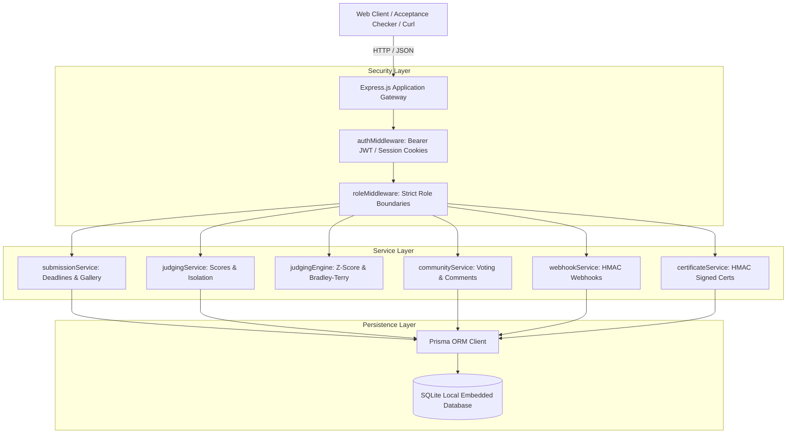

# DOGFOOD 2026: Architecture & Security Threat Model

## 1. System Architecture

The DOGFOOD platform is built around a secure, modular, offline-first architecture designed to operate with zero cloud dependencies.



---

## 2. Role-Based Access Control (RBAC) & Boundary Isolation

The platform enforces five distinct privilege tiers. Access boundaries are strictly enforced in backend middleware and controllers, never relying on UI hiding.

| Role | Scope | Permissions & Isolation Boundaries |
| :--- | :--- | :--- |
| **Stranger / Public** | Global | Browse published project gallery, view public leaderboard (if published), verify certificates, view embed widget. |
| **Participant** | Team / Event | Create team, submit/edit project before deadline. **Strictly blocked (403)** from judging endpoints, scores, and judge review queues. |
| **Judge** | Assigned Event | Evaluate assigned projects, submit rubric scores, submit pairwise comparisons. **Strictly blocked (403)** from inspecting peer scores. |
| **Organizer** | Owned Event | Configure criteria, auto/batch assign judges, run cross-judge normalization, export CSV results, toggle community voting, manage webhooks, issue certificates. |
| **Global Admin** | System | Cross-event audit logging, user role management, system health inspection. |

### Parameter Tampering Defense: The `peer_scores` Check
In many naive implementations, `/api/judge/scores?judge=judge_a` checks authentication but ignores whether the caller is actually `judge_a`. Our platform inspects the query parameter, extracts caller identity from the cryptographic JWT, and executes strict server-side validation:
```javascript
const targetJudgeParam = query.judge || query.judgeId;
if (targetJudgeParam && !isGlobalAdmin && !isOrganizer) {
  if (!matchesUserIdentity(targetJudgeParam, currentUser)) {
    throw new ForbiddenError('You do not have permission to access another judge\'s scores.');
  }
}
```
If `judge_b` passes `?judge=judge_a`, the backend immediately logs an `AUTH_DENIED` audit event and returns `403 Forbidden`.

---

## 3. Threat Model & Adversarial Defense

### Threat 1: Sybil Attacks & Ballot Stuffing on Community Voting
* **Attack Vector:** An adversary scripts thousands of HTTP requests with fabricated emails or rotated IPs to artificially inflate a project's community vote count.
* **Mitigations:**
  1. **Canonical Email Deduplication:** Database-level compound unique constraint `@@unique([submissionId, voterEmail])` guarantees that one email can never vote for the same project twice.
  2. **Sliding-Window IP Rate Limiting:** In-memory sliding window limiter caps maximum votes per IP per hour ($M = 30$), stopping burst bot traffic.
  3. **Voting Window Sealing:** Results remain cryptographically sealed until the organizer explicitly reveals them, denying adversaries immediate feedback on their vote-stuffing campaigns.

### Threat 2: Judge Severity & Leniency Bias
* **Attack Vector:** One judge scores all assigned projects between 1/5 and 2/5, while another awards 5/5 to everyone. A project evaluated by the strict judge is unfairly penalized.
* **Mitigations:**
  1. **Cross-Judge Z-Score Normalization:** Shifts and rescales each judge's score distribution to align with the global mean $\mu_{\text{global}}$ and target variance $\sigma_{\text{target}}^2$.
  2. **Zero-Variance Anchor:** When a judge assigns identical scores to all projects, the division-by-zero vulnerability is averted by assigning $z = 0$, centering their evaluations at the neutral global mean without skewing rankings.

### Threat 3: Judge Collusion & Strategic Downvoting
* **Attack Vector:** A compromised judge deliberately awards minimum scores to strong competing projects to benefit a favored team.
* **Mitigations:**
  1. **Bradley-Terry Pairwise Mode:** In addition to numerical rubric scores, judges can be asked to make binary relative comparisons (*Project A vs Project B*). Pairwise choices are harder to game strategically because rankings derive from the collective graph of head-to-head outcomes.
  2. **Audit Logging:** Every scoring mutation, pairwise comparison, and authorization failure creates an immutable record in `AuditLog` storing actor, timestamp, IP, and payload snapshot.

### Threat 4: Data Leakage Across Judge Boundaries
* **Attack Vector:** A judge inspects browser developer tools, discovers API endpoints, and queries peer evaluations to align their scoring with senior judges or leak scores to participants.
* **Mitigations:**
  1. Server-authoritative data scoping: API queries are filtered by `judgeId` at the database query level.
  2. Role checks throw explicit `403 Forbidden` rather than returning empty arrays, signaling an active refusal rather than a missing record.

### Threat 5: Late Submissions & Clock Skew
* **Attack Vector:** A participant attempts to submit their project after the hackathon deadline by spoofing client timestamps or sending a delayed multipart request.
* **Mitigations:**
  1. Server-authoritative clock: The server checks `new Date() > new Date(event.deadline)` using UTC time on every submission attempt.
  2. Submissions past the deadline are strictly refused with `403 Forbidden` (`4xx`), fully satisfying the DOGFOOD acceptance checker.

---

## 4. Offline Zero-Dependency Architecture

The application is containerized with standard multi-stage Docker builds. 
- No cloud accounts (AWS, Firebase, Supabase).
- No external CDN links required for core operations.
- SQLite is embedded and managed via Prisma ORM.
- Container startup automatically runs database migrations, fixture seeding, and brings up the portal on port 8080.
