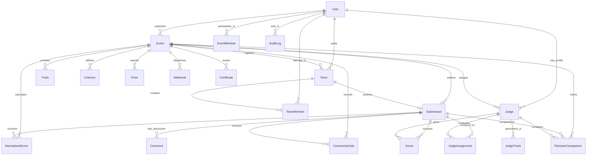

# DOGFOOD 2026: Data Model & Import/Export Formats

## 1. Entity-Relationship Diagram



---

## 2. Core Model Specifications

### 2.1 User & Event
- `User`: Global account identity (`id`, `email`, `passwordHash`, `name`, `isGlobalAdmin`).
- `Event`: Hackathon configuration (`id`, `title`, `tagline`, `description`, `rules`, `minTeamSize`, `maxTeamSize`, `startDate`, `deadline`, `judgingDeadline`, `status`, `isLeaderboardPublished`, `isCommunityVotingOpen`, `isCommunityResultsRevealed`, `organizerId`).
- `EventMember`: Compound relation `@@id([eventId, userId])` defining role (`ORGANIZER`, `JUDGE`, `PARTICIPANT`).

### 2.2 Teams & Submissions
- `Team`: Student team (`id`, `eventId`, `name`, `inviteCode`, `leaderId`, `isRegistered`). Unique compound key on `[eventId, name]`.
- `TeamMember`: Team roster `@@unique([teamId, userId])`.
- `Submission`: Project entry (`id`, `teamId`, `eventId`, `trackId`, `title`, `tagline`, `description`, `repoUrl`, `demoUrl`, `videoUrl`, `techStack`, `status`, `submittedAt`).

### 2.3 Judging, Rubric & Normalization
- `Criterion`: Rubric criterion (`id`, `eventId`, `name`, `description`, `maxScore`, `weight`).
- `Judge`: Event judge profile (`id`, `eventId`, `userId`, `status`). Unique on `[eventId, userId]`.
- `JudgeAssignment`: Assignment queue `@@unique([judgeId, submissionId])`.
- `Score`: Raw rubric evaluation `@@unique([submissionId, judgeId, criterionId])`.
- `NormalizedScore`: Cross-judge standardized score (`id`, `eventId`, `submissionId`, `judgeId`, `rawScore`, `normalizedScore`, `metadata`).

### 2.4 Community, Webhooks, Pairwise & Certificates
- `CommunityVote`: Anti-sybil vote `@@unique([submissionId, voterEmail])` with `voterIp` audit field.
- `Comment`: Project feedback thread (`id`, `submissionId`, `authorName`, `authorEmail`, `content`, `createdAt`).
- `Webhook`: Event listener endpoint (`id`, `eventId`, `url`, `secret`, `events`, `isActive`).
- `PairwiseComparison`: Relative head-to-head match (`id`, `eventId`, `judgeId`, `winnerId`, `loserId`).
- `Certificate`: Verifiable participation record (`id`, `eventId`, `recipientName`, `recipientEmail`, `role`, `signature`, `metadata`).
- `AuditLog`: Security audit log (`id`, `actorId`, `action`, `targetType`, `targetId`, `metadata`, `timestamp`).

---

## 3. Data Import & Export Specifications

### 3.1 Fixture Import Format (`fixtures.json`)
The platform ingests the official hackathon fixture dataset conforming to the kickoff spec:
```json
{
  "event": {
    "id": "evt_01",
    "name": "Sample Hack 2026",
    "submissions_close": "2026-03-01T18:00:00Z"
  },
  "tracks": [
    { "id": "trk_01", "name": "Developer tools" }
  ],
  "judges": [
    { "id": "jdg_01", "name": "Ada Okonkwo", "email": "ada@example.org", "tracks": ["trk_01"] }
  ],
  "teams": [
    { "id": "tm_01", "name": "Nightshift", "members": ["ada@example.org", "participant@hack.com"] }
  ],
  "projects": [
    {
      "id": "prj_01",
      "team": "tm_01",
      "track": "trk_01",
      "title": "Quiet Hours",
      "summary": "Focus time scheduler",
      "repo_url": "https://example.org/repo",
      "submitted_at": "2026-02-28T22:14:00Z"
    }
  ],
  "scores": [
    {
      "judge": "jdg_01",
      "project": "prj_01",
      "criteria": { "functionality": 4, "quality": 3 },
      "comment": "Solid implementation."
    }
  ]
}
```

### 3.2 Organizer CSV Export Format (`/api/organizer/judging/export.csv`)
The CSV endpoint exports comma-delimited tables with UTF-8 encoding.
Header row structure for `type=results`:
```csv
Rank,Submission ID,Project Title,Team Name,Track,Reviews Completed,Raw Average,Normalized Score,Status
1,3,"Quiet Hours","Nightshift","Developer tools",3,4.5,8.7,"SCORED"
2,4,"NeuroFlow","Team NeuroFlow","AI & Machine Learning",3,4.2,8.4,"SCORED"
```

Header row structure for `type=scores`:
```csv
Submission ID,Project Title,Team Name,Track,Judge Name,Judge Email,Criterion,Raw Score,Max Score,Weight,Weighted Score,Feedback,Submitted At
```

### 3.3 Verifiable Certificate Schema
Generated by `POST /api/certificates/issue` and verified by `GET /api/certificates/verify/:id`:
```json
{
  "isValid": true,
  "certificateId": "CERT-4-MUD7U43T-39DDB8",
  "recipientName": "Ada Okonkwo",
  "recipientEmail": "ada@example.org",
  "role": "JUDGE",
  "eventName": "Sample Hack 2026",
  "issuedAt": "2026-09-22T21:58:22.794Z",
  "metadata": {
    "track": "Developer tools",
    "reviewsCompleted": 8,
    "certifiedHours": 12
  },
  "issuer": "Sarah Connor (Organizer)",
  "verificationAlgorithm": "HMAC-SHA256",
  "status": "OFFICIALLY_VERIFIED"
}
```
