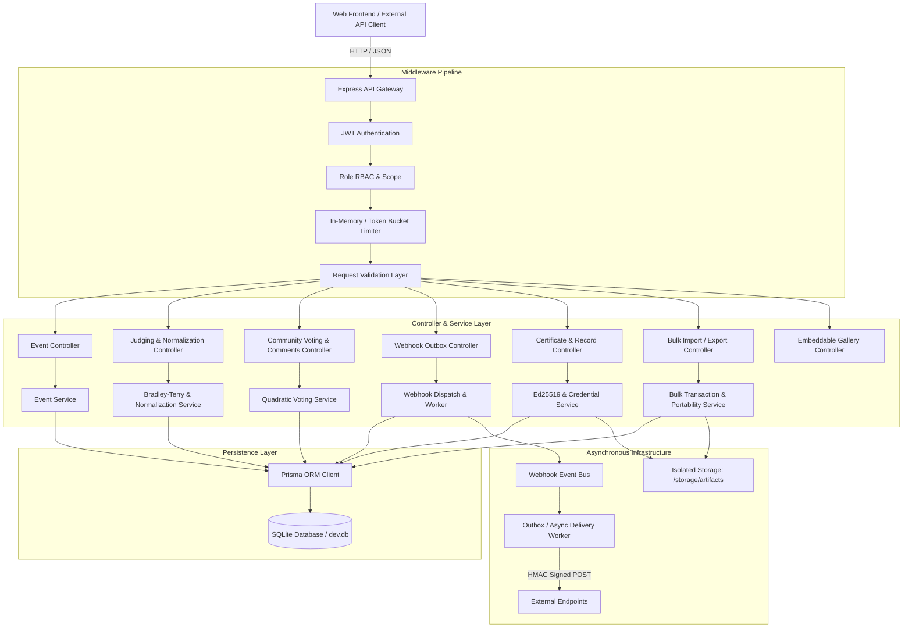

# CATFOOD Platform Architecture

## 1. System Overview
The **DOGFOOD 2026 Hackathon Judgment Platform (CATFOOD)** is an enterprise hackathon management and multi-criterion judgment system built with Node.js, Express, React (Vite), Prisma ORM, and SQLite.

## 2. Component Architecture

## 3. Request Flow & Execution Stages
1. **Transport & Entrypoint:** Incoming requests hit `backend/src/server.js`, which applies CORS, URL encoding, JSON body parsing, and routing.
2. **Authentication:** `authMiddleware.js` extracts Bearer JWT tokens from headers or cookies, decodes the payload, and verifies the user's presence in SQLite.
3. **Authorization:** Centralized permission checks via `canManageEvent(currentUser, eventId)` enforce tenant scoping across Global Admins, Event Creators, Co-Organizers, Judges, and Participants.
4. **Controllers & Validation:** Controllers unpack `params`, `query`, and `body`, run schema validations, and delegate business logic to dedicated services.
5. **Services:** Core business logic (Bradley-Terry estimation, z-score normalization, quadratic voting math, cryptographic signing, transactional imports).
6. **Persistence & Transactions:** Prisma client connects to SQLite, utilizing `prisma.$transaction` for multi-table atomic consistency.
7. **Outbound Dispatch:** Lifecycle actions publish events to `WebhookEventBus`, which stages delivery records in the outbox table for reliable processing.
