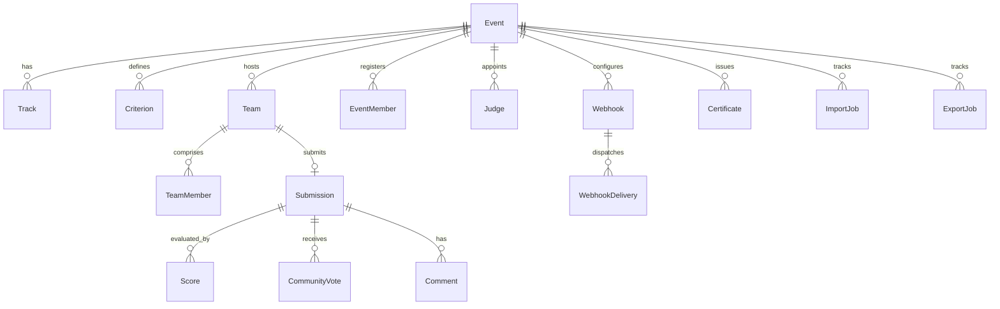

# CATFOOD Data Model Specification

## 1. Core Entity Relationship Diagram

## 2. Infrastructure & Hardened Models (Phase 2 Additions)

### Webhook & WebhookDelivery
- `Webhook`: Endpoint configuration with `isActive`, `failureCount`, secret hash/token, and topic subscriptions.
- `WebhookDelivery`: Individual delivery attempts tracking `id`, `webhookId`, `eventType`, `payload`, `responseStatus`, `responseBody`, `durationMs`, `status` (`PENDING`, `SUCCESS`, `FAILED`), `attempts`, `nextRetryAt`.

### Certificate
- Fields: `id`, `eventId`, `recipientName`, `recipientEmail`, `role`, `signature`, `metadata`, `issuedAt`, `status` (`ACTIVE`, `REVOKED`), `revokedAt`, `revokedBy`, `revocationReason`, `keyId`, `algorithm` (`Ed25519`), `artifactPath`.

### SigningKey
- Fields: `id`, `keyId`, `algorithm`, `publicKey`, `status` (`ACTIVE`, `RETIRED`), `createdAt`, `activatedAt`, `retiredAt`. Stores public cryptographic keys for signature verification.

### ImportJob & ExportJob
- Fields: `id`, `eventId`, `type`, `status` (`QUEUED`, `PROCESSING`, `COMPLETED`, `FAILED`), `progress`, `totalItems`, `processedItems`, `errorCount`, `errorLog`, `artifactPath`, `createdBy`, `createdAt`, `completedAt`.

### EmbedConfig
- Embed configuration per event: `theme`, `layout`, `pageSize`, `allowFiltering`, `allowSearch`, `showScores`, `customCss`.
