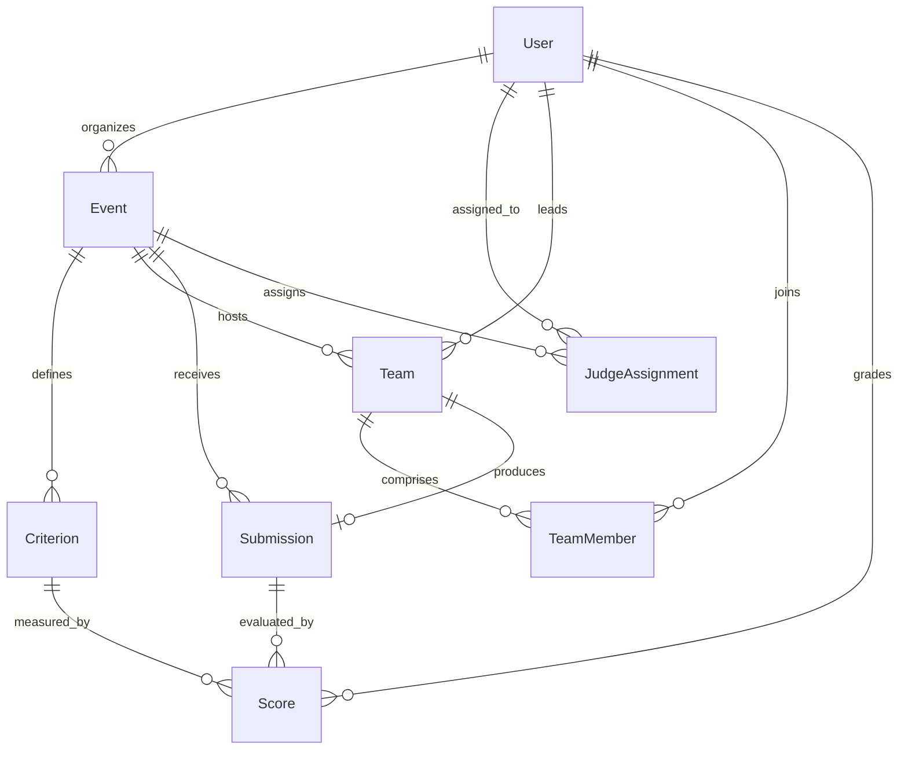

# Implementation Guide — Database & Prisma ORM

## 1. Database Engine

- **Engine**: SQLite 3
- **File Location**: `backend/prisma/dev.db`
- **ORM**: Prisma ORM (`@prisma/client` and `prisma`)

---

## 2. Entity Relationship Schema



---

## 3. Schema Models (`schema.prisma`)

- **User**: Authentication record, name, email, role (`ORGANIZER`, `JUDGE`, `PARTICIPANT`).
- **Event**: Hackathon metadata, rules, start time, submission deadline, judging deadline, and publish status.
- **Criterion**: Evaluation rubric with `name`, `maxScore`, and `weight`.
- **JudgeAssignment**: Mapping between assigned judges and specific events.
- **Team**: Team identity, event binding, and unique `inviteCode`.
- **TeamMember**: Many-to-many relationship linking users to teams with unique constraints.
- **Submission**: Project deliverables (`title`, `description`, `repoUrl`, `demoUrl`, `videoUrl`, `techStack`).
- **Score**: Rubric score and qualitative feedback tied to a specific judge, submission, and criterion.

---

## 4. Prisma Commands

```bash
# Push schema updates to SQLite dev.db
npm run prisma:push

# Generate typed Prisma client
npm run prisma:generate

# Populate demo data
npm run seed
```
