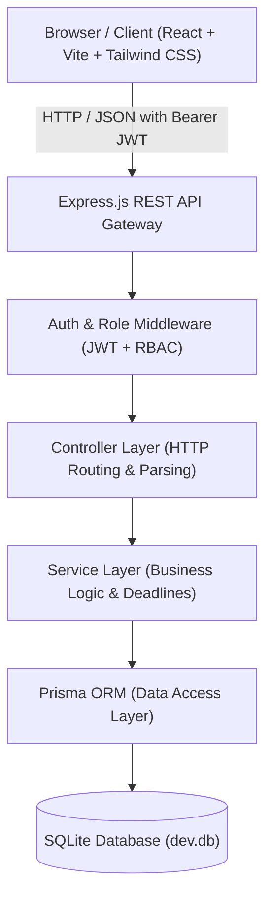

# Architectural Report — Hackathon Judgment Platform

## Executive Summary

The **Hackathon Judgment Platform** (JuryFlow) is designed to operate high-stakes hackathons, engineering competitions, and project showcases. The platform enforces strict separation between client-side user experience, server-side business rules, persistent storage, automated testing, and comprehensive technical documentation.

---

## 1. High-Level System Architecture



---

## 2. Decoupled Application Boundaries

### 2.1 Frontend Boundary (`frontend/`)
- **Technology Stack**: React 18, Vite, Tailwind CSS.
- **Responsibilities**:
  - UI component composition and responsive rendering.
  - Client-side form input validation for fast user feedback.
  - Interactive evaluation rubrics with instant client feedback.
  - Real-time countdown tickers for submission deadlines.
  - State management via React Context (`AuthContext`).
  - Centralized API communications (`services/api.js`).
- **Security Boundary Stance**: The frontend is considered **untrusted**. No frontend state or role flag can authorize a privileged mutation.

### 2.2 Backend Boundary (`backend/`)
- **Technology Stack**: Node.js, Express.js, Prisma ORM, SQLite, Nodemon.
- **Responsibilities**:
  - Exposing REST API contracts under `/api/*`.
  - Identity verification and cryptographically signed JWT issuance.
  - Role-Based Access Control (RBAC): `ORGANIZER`, `JUDGE`, `PARTICIPANT`.
  - Enforcing immutable business constraints (e.g. strict submission deadline enforcement).
  - Normalizing and computing weighted rubric scores and generating rankings.
  - Data persistence and transaction handling via Prisma.

---

## 3. Modular Backend Request Flow

Every inbound request traverses an explicit 5-tier pipeline:

```text
HTTP Request
     ↓
1. Route Handler (`/routes/*`)
     ↓
2. Middleware (`/middleware/*`)
     ├─ Authentication (Bearer JWT verification)
     ├─ Role-Based Access Control (ORGANIZER, JUDGE, PARTICIPANT)
     ├─ Input Validation (Schema checks)
     └─ Error Handling & Logging
     ↓
3. Controller (`/controllers/*`)
     ├─ Extracts parameters (`req.params`, `req.query`, `req.body`)
     └─ Hands typed payloads to Service modules
     ↓
4. Service (`/services/*`)
     ├─ Evaluates business rules (deadline expiration, team membership)
     ├─ Performs mathematical operations (weighted rubric scoring)
     └─ Enforces atomicity (Database transactions)
     ↓
5. Data Access Layer (`Prisma ORM`)
     ↓
SQLite Storage Engine (`dev.db`)
```

---

## 4. Key Architectural Decisions

| Decision | Rationale |
| :--- | :--- |
| **Separation of Concerns** | Decouples UI evolution from core business invariants and auditability. |
| **SQLite + Prisma** | Embedded, zero-configuration persistence with strongly typed schema models and migration integrity. |
| **Server-Side Deadline Enforcement** | Prevents late submissions regardless of client manipulation, browser clock tampering, or direct API scripting. |
| **Isolated Test Suite (`tests/`)** | Test runners operate against real HTTP endpoints independently from application bundles. |
| **Isolated Docs Suite (`docs/`)** | Architectural blueprints and implementation references are kept strictly distinct from production code. |
